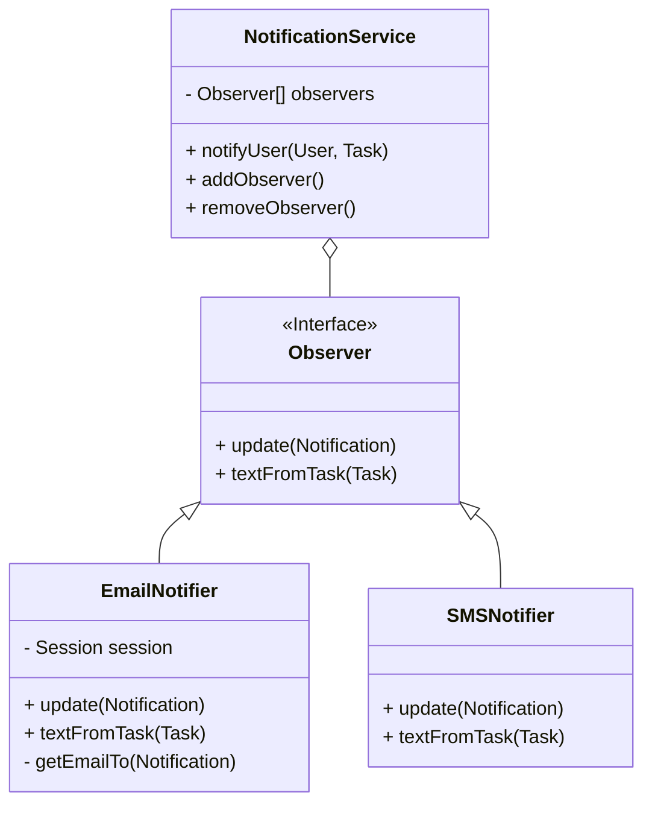

### Notification System Class Diagram

```mermaid
classDiagram
Observer <|-- EmailNotifier
Observer <|-- SMSNotifier
<<Interface>> Observer
Observer : + update(Notification)
Observer : + textFromTask(Task)
EmailNotifier : + update(Notification)
EmailNotifier : + textFromTask(Task)
EmailNotifier : - Session session
EmailNotifier : - getEmailTo(Notification)
SMSNotifier : + update(Notification)
SMSNotifier : + textFromTask(Task)
NotificationService o-- Observer
NotificationService : - Observer[] observers
NotificationService : + notifyUser(User, Task)
NotificationService : + addObserver()
NotificationService : + removeObserver()
```
